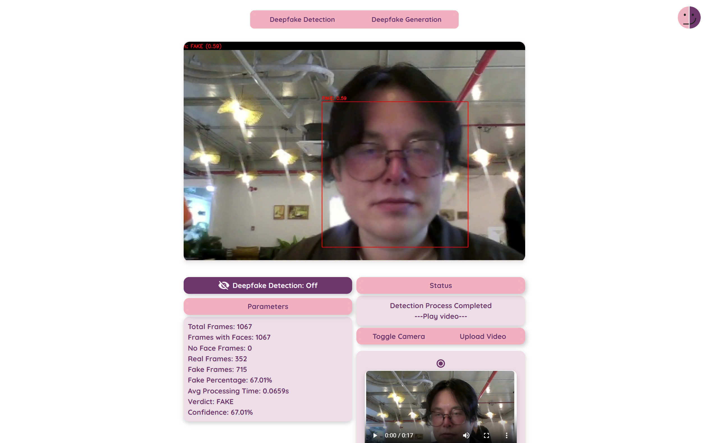
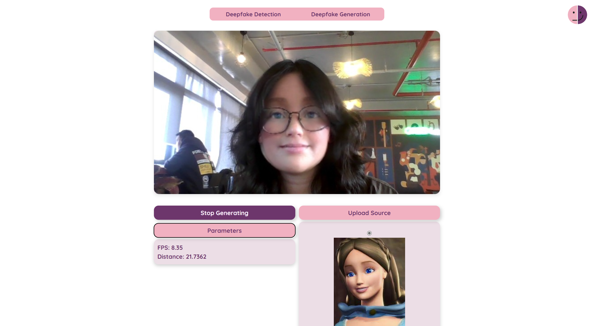

### Introduction
#### Deepfake Detection

#### Deepfake Generation


---

### Instruction
#### Installation:
- Without venv
```
git clone https://github.com/nhi-nhi-nhi/DeepMirror.git
cd DeepMirror
pip install -r requirements.txt
```
  - With miniconda
```
git clone https://github.com/nhi-nhi-nhi/DeepMirror.git
cd DeepMirror
conda create --name DeepMirror python=3.12
conda activate DeepMirror
pip install -r requirements.txt
```

#### To run the app:

```

    flask run -p <port-num>

```

___

### License

This project is licensed under the MIT License - see the LICENSE file for details.

---

### Contact

If you need help or want to get in touch with the project maintainers, feel free to contact us:

- **Email**: lephanquynhnhi1011@gmail.com
    
- **GitHub**: [https://github.com/nhi-nhi-nhi](https://github.com/nhi-nhi-nhi)